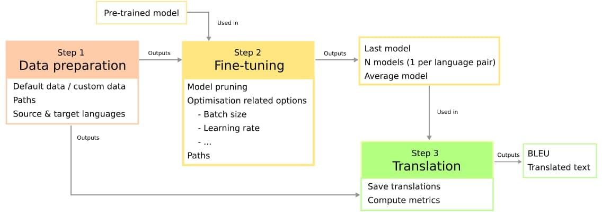

# Adaptable pipeline for InterL

## Description

This project provides the data preparation, fine-tuning and evaluation of an [mBART model](https://arxiv.org/abs/2001.08210 "Link to the ArXiV paper").

## Installation

Open a terminal and execute the following:

```
chmod +x setup.sh
./setup.sh
```

Also execute:

```
git clone https://github.com/LaSTUS-TALN-UPF/NMT-Evaluation
mv NMT-Evaluation NMTEvaluation
```

## Arguments to control the pipeline

The `args.json` file contains all the necessary arguments to control the whole pipeline (preparing the data, and fine-tuning and evaluating the model). Through this documentation, any argument contained within this file will be denoted as `args.json:<name_of_argument>`, as in `args.json:batch_size`. The following figure illustrates the pipeline's workflow.



## Step 1: Preparing the data

The `prepare_data.sh` may download some language pairs from the ParaCrawl corpus if the `args.json:use_default_dataset` argument is set to True. Otherwise, it expects a custom dataset from the user. The paths should be set as follows:

```
<args.json:corpora_dir>/
        es-en/
                <args.json:train_mode>_es-en.txt
                <args.json:evaluation_mode>_es-en.txt
        en-es/
                <args.json:train_mode>_en-es.txt
                <args.json:evaluation_mode>_en-es.txt
```

In the above example, the English-Spanish language pair is used as example in both the English-to-Spanish and Spanish-to-English directions. However, any language pair or pairs can be used (as many as desired). By default, the `prepare_data.sh` script downloads the English-Spanish and English-Dutch languages (in both directions) from the ParaCrawl 7.1 corpus and prepares the train and test splits. `args.json:test_size` can be used to specify the size of the test set (with a fixed integer number), randomly subsampled from the dataset. Having the custom data prepared or `args.json:use_default_dataset` set to True, run:

```
python prepare_data.py args.json
```

The script also downloads the pre-trained mBART model, the tokeniser and the original vocabulary file. The vocabulary is computed from the dataset and can be reduced if `args.json:pruned_vocabulary` is set to True to `args.json:vocabulary_size` samples (integer). Otherwise, the whole vocabulary is used. Finally, the dataset is tokenised using the SentencePiece model from mBART.

After the scripts finishes, all the contents of the `<args.json:corpora_dir>/<language_pair>/temp/` folders can be deleted, as they are not necessary. Nevertheless, notice that the original train and test files are copied to that folder (they can be retrieved from there), as they are replaced by their tokenised version.

## Step 2: Fine-tuning

The second step if composed of three parts. The first one is optional: `args.json:pruned_vocabulary` must be set to True, starting the prunning of the mBART model. As the vocabulary is reduced, the embedding matrix of the model should be reduced too, making a mapping to a new vocabulary. The second step is the-finetuning itself, performed by the script `finetune.py` that is called to be run in the background. The script itself can be called separately to the `train.py` script if desired. In the final step, an average model is created taking all the language-specific models and averaging their weights.

Due to the usage of accelerate for the fine-tuning, first set the configuration using:

```
accelerate config
```

To run the three sub-steps one after another run:

```
python train.py args.json
```

Otherwise, run:

```
python trim_bart.py args.json
nohup python -u -m torch.distributed.launch --nproc_per_node <number_of_gpus> --use_env --nproc_per_node <number_of_gpus> finetune.py args.json 2>&1 &
```

There are several options within `args.json` to customise this step.

## Step 3: Translating and evaluation

After the model is fine-tuned, to translate the files named with the prefix `args.json:evaluation_mode` one can run:

```
python translate.py args.json
```

They will be saved in the `<args.json:output_dir>/<args.json:predictions_dir>` folder, in a specific language folder. Then, to evaluate the results one can run:

```
python evaluate.py args.json
```

The results will be saved again in the folder `<args.json:output_dir>/<args.json:predictions_dir>`, in a specific language folder.
